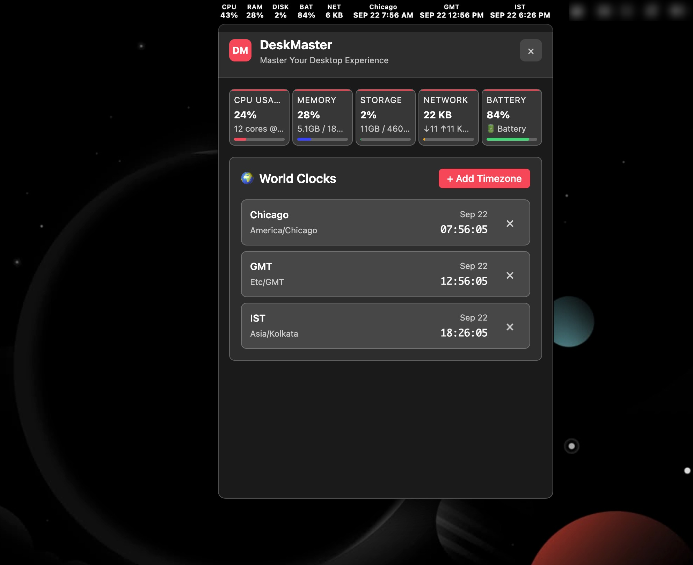

# DeskMaster

  
  
  **Master your desktop experience with system monitoring, world clocks, and productivity tools**
  
  
  
  

## 📸 Screenshots

  
  
<em>Main application interface with system monitoring and world clocks</em>

  
  
  
<em>System tray with real-time statistics</em>

## ✨ Features

### 🖥️ **System Monitoring**
- **Real-time CPU usage** with core details and temperature
- **Memory monitoring** with used/total RAM display
- **Storage tracking** across all drives
- **Network activity** with upload/download speeds
- **Battery status** (on laptops)
- **Live updates** every second in the system tray

### 🌍 **World Clocks**
- **Multiple timezone support** - add unlimited timezones
- **Custom labels** for each timezone
- **12/24 hour format** support
- **Automatic DST handling**
- **Quick timezone switching**

### 🎨 **Modern Interface**
- **Dark/Light theme** support with system preference detection
- **Responsive design** built with React and Tailwind CSS
- **Smooth animations** and transitions
- **Native macOS integration** with proper window management

### 🔧 **Productivity Tools**
- **System tray integration** for quick access
- **Auto-start option** (configurable)
- **Minimal resource usage**
- **Background operation** without interrupting workflow

## 🚀 Installation

### Download for macOS

Choose the version that matches your Mac:

| Architecture | Download | Size |
|-------------|----------|------|
| **Apple Silicon** (M1/M2/M3) | [DeskMaster-arm64.dmg](https://github.com/bewithdhanu/deskmaster/releases/latest) | ~85 MB |
| **Intel Mac** | [DeskMaster-x64.dmg](https://github.com/bewithdhanu/deskmaster/releases/latest) | ~90 MB |

### Installation Steps

1. **Download** the appropriate DMG file for your Mac
2. **Open** the DMG file
3. **Drag** DeskMaster to your Applications folder
4. **Launch** DeskMaster from Applications or Spotlight
5. **Enjoy** your new desktop productivity tool!

## 🎯 Quick Start

### First Launch
1. DeskMaster will appear in your system tray (menu bar)
2. Click the tray icon to open the main window
3. Add your first timezone by clicking the "+" button
4. Customize your timezone labels as needed

### System Tray
- **Click** the tray icon to open/close the main window
- **Right-click** for additional options
- **Hover** to see quick system stats

### Adding Timezones
1. Click the **"+"** button in the timezone section
2. Search for your desired timezone
3. Add a custom label (optional)
4. Click **"Add Timezone"**

## ⚙️ Configuration

### Themes
- DeskMaster automatically detects your system theme preference
- Switch between light and dark modes
- Theme changes apply instantly across the entire application

### Auto-Start
- Enable auto-start to launch DeskMaster when you log in
- Access this option through the system tray menu
- Perfect for keeping your productivity tools always available

## 🛠️ System Requirements

- **macOS 10.12** (Sierra) or later
- **Apple Silicon** (M1/M2/M3) or **Intel** processor
- **50 MB** free disk space
- **Internet connection** for timezone data (optional)

## 📱 Supported Platforms

DeskMaster is currently available for:
- ✅ **macOS** (Apple Silicon & Intel)

## 🐛 Issues & Support

- **Report bugs**: [GitHub Issues](https://github.com/bewithdhanu/deskmaster/issues)
- **Feature requests**: [GitHub Discussions](https://github.com/bewithdhanu/deskmaster/discussions)
- **Developer info**: [Development Guide](DEVELOPMENT.md)

---

  
Made with ❤️ by <a href="https://github.com/bewithdhanu">Dhanu K</a>

  
⭐ Star this repo if you find it useful!

